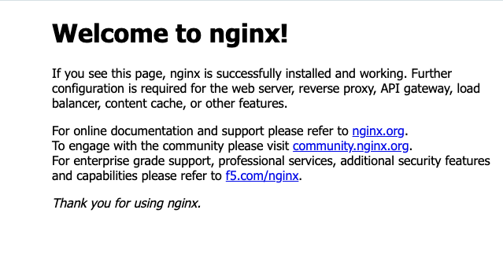

# Terraform AWS nginx Web Server

This project provisions an AWS EC2 instance running nginx in a Docker container in **eu-central-1 (Frankfurt)**. Terraform creates the network and instance, and an EC2 user-data script installs Docker and starts nginx.

The nginx web application is reachable through a web browser at **`http://<ec2_public_ip>:8080`** after bootstrap completes. Host port `8080` forwards to port `80` inside the container. The project serves the nginx image's default page; it does not include custom application code.

## Architecture

```text
Web browser ── HTTP :8080 ── Internet gateway ── Public subnet
                                                  │
                                             EC2 instance
                                                  │
                                       Docker: host 8080 → container 80
                                                  │
                                                nginx

Administrator ── SSH :22 (my_ip CIDR only) ── EC2 instance
```

The subnet uses the VPC's default route table implicitly. Terraform manages that route table and adds a `0.0.0.0/0` route through the internet gateway. The instance explicitly receives a public IPv4 address and uses the VPC's managed default security group.

## AWS resources

| Configuration | Purpose |
| --- | --- |
| `aws_vpc.myapp-vpc` | Creates a VPC using `vpc_cidr_block`. |
| `module.myapp-subnet.aws_subnet.myapp-subnet-1` | Creates one subnet in the chosen availability zone. |
| `module.myapp-subnet.aws_internet_gateway.myapp-igw` | Creates and attaches an internet gateway to the VPC. |
| `module.myapp-subnet.aws_default_route_table.main-rtb` | Manages the VPC's existing default route table and its internet route. |
| `module.myapp-server.aws_default_security_group.default-sg` | Manages the VPC's existing default security group: SSH from `my_ip`, public TCP `8080`, and unrestricted IPv4 egress. |
| `module.myapp-server.aws_key_pair.ssh-key` | Registers a supplied public SSH key with the fixed AWS key-pair name `server-key`. |
| `module.myapp-server.aws_instance.myapp-server` | Creates one EC2 instance with a public IP and the Docker/nginx bootstrap script. |

The `aws_ami.latest-amazon-linux-image` data source selects the newest Amazon-owned HVM AMI matching `image_name`; it looks up an existing image rather than creating one. Resource `Name` tags generally use `env_prefix`.

No load balancer, NAT gateway, Elastic IP, DNS record, TLS certificate, autoscaling group, or remote Terraform backend is configured.

## Prerequisites

- Terraform CLI installed. The project does not declare a minimum Terraform version.
- An AWS account and credentials available to the AWS provider, for example through an AWS CLI profile. The identity needs permissions to look up AMIs and manage the listed EC2/VPC resources and tags.
- AWS CLI if using the credential verification command below, an SSH client for instance troubleshooting, and a browser or `curl` for HTTP verification.
- An existing SSH key pair on your computer. Terraform uploads the public key; it does not generate keys or upload the private key.
- A matching Amazon Linux AMI that supports `yum`, `systemctl`, and the `ec2-user` account, with an architecture compatible with your instance type. The image must execute EC2 shell user data (normally through cloud-init) and provide Docker through its configured package repositories.
- Permission and sufficient EC2/VPC service quota to create the listed resources. The selected instance type must be offered in your chosen availability zone.
- Network access for Terraform provider downloads and for the instance to download packages and the nginx container image.

Docker is installed on EC2 by the bootstrap script; it is not required on your local computer. The shell examples below assume Bash or a compatible shell such as Zsh. The public-key file must exist and be readable before planning because Terraform reads it with `file()`.

The AWS provider constraint is `~> 6.0`; the committed `.terraform.lock.hcl` locks version `6.57.1`. The region is hardcoded in root `main.tf`, so select an availability zone in `eu-central-1` unless you change that provider configuration.

Provisioning incurs AWS charges, including applicable instance, storage, and public IPv4 charges.

## Configure inputs

Run commands from the project root. Configure credentials using your normal AWS authentication workflow. For a named profile:

```bash
export AWS_PROFILE=your-profile
aws sts get-caller-identity
```

Create or update `terraform.tfvars` with values appropriate for your account. The following values are examples, not additional infrastructure defaults:

```hcl
vpc_cidr_block       = "10.0.0.0/16"
subnet_cidr_block    = "10.0.10.0/24"
avail_zone          = "eu-central-1b"
env_prefix          = "dev"
my_ip               = "203.0.113.10/32" # Replace with your actual public IPv4 /32.
instance_type       = "t3.micro"
public_key_location = "/absolute/path/to/your/key.pub"
private_key_location = "/absolute/path/to/your/key"
image_name          = "al2023-ami-2023.*-x86_64" # Example Amazon Linux AMI name filter.
```

| Input | Meaning |
| --- | --- |
| `vpc_cidr_block` | IPv4 CIDR for the VPC. |
| `subnet_cidr_block` | Subnet CIDR within the VPC range. |
| `avail_zone` | Availability zone for both subnet and instance. |
| `env_prefix` | Prefix for resource name tags. |
| `my_ip` | CIDR allowed to connect over SSH; normally your public IPv4 address with `/32`. |
| `instance_type` | EC2 instance type, compatible with the selected AMI. |
| `public_key_location` | Local public-key file read by Terraform. |
| `private_key_location` | Required root input, but unused by the resources or modules. Terraform does not read this file. |
| `image_name` | AMI name filter used to select the newest matching Amazon-owned HVM image. |

All root variables have no defaults or explicit type constraints. The local `terraform.tfvars` inspected for this documentation omits `image_name` and `private_key_location`; supply both to avoid interactive prompts. That file is ignored by Git and may be absent from a fresh clone. Review the AMI selected in the plan; the filter above is an example and availability is not verified by this documentation.

Before planning, check these input requirements:

- Use a subnet CIDR contained within `vpc_cidr_block` and an availability zone in the configured region.
- Set `my_ip` to a CIDR, not a bare IP address. The example address is a documentation placeholder and will not grant access from your computer.
- Set `image_name` to an AMI **name or name pattern**, not an AMI ID. The code filters by name, Amazon ownership, and HVM virtualization; it does not separately filter by CPU architecture. Select an architecture-specific pattern that matches `instance_type`.
- Supply the public key in OpenSSH public-key format. Keep its matching private key for manual SSH access; the unused `private_key_location` input still needs a value because it has no default.

These constraints are not enforced through variable validation blocks in the current code.

The AWS key-pair name `server-key` must be available in the target account and region, or an existing key must be reconciled with this configuration before applying.

## Initialize, validate, and plan

```bash
terraform init
terraform validate
terraform plan
```

`init` installs providers and initializes the local modules. Terraform loads `terraform.tfvars` automatically. Inspect the plan's account context, AMI, networking, security rules, and any replacements or deletions before applying.

**Existing local state:** the inspected `terraform.tfstate` contains `aws_vpc.myapp-vpc`, which still matches the current VPC address, and `aws_subnet.myapp-subnet-1`, which no longer matches the subnet’s current address, `module.myapp-subnet.aws_subnet.myapp-subnet-1`. The backup also contains older addresses. There are no state migration declarations in the code. If reusing this workspace, review the plan carefully and reconcile existing state as needed before applying; do not assume existing infrastructure will be preserved unchanged. Keep state files secure and do not delete them to bypass a discrepancy.

## Terraform outputs

| Location | Output | Value |
| --- | --- | --- |
| Root | `ec2_public_ip` | Public IPv4 address of the EC2 instance; use this for browser access. |
| Subnet module | `subnet` | Subnet resource object, used by the root configuration to pass its ID to the server module. |
| Webserver module | `instance` | EC2 instance ID. |
| Webserver module | `public_ip` | EC2 public IPv4 address, exposed by the root output. |

Only `ec2_public_ip` is exposed by the root `terraform output` command. Both child modules use the root AWS provider configuration; their `providers.tf` files are empty.

## Apply

```bash
terraform apply
```

Review the displayed plan and enter `yes` to provision it. Terraform outputs `ec2_public_ip` when complete.

Terraform passes `modules/webserver/entry-script.sh` as EC2 user data; run the Terraform commands locally, and let the instance execute this script as root during bootstrap. No Terraform SSH provisioner is configured. The script:

1. Runs `yum update -y` and installs Docker if the update succeeds.
2. Starts the Docker service.
3. Adds `ec2-user` to the Docker group.
4. Runs `docker run -d -p 8080:80 nginx`.

The untagged `nginx` reference uses the default `latest` tag. There is no custom content, volume mount, container name, or restart policy. The script starts Docker but does not explicitly enable it at boot. Automatic application recovery after reboot is therefore not configured. Changing user data replaces the instance because `user_data_replace_on_change = true`.

## Verify the web application

### Deployment evidence

The screenshot below shows the nginx welcome page from the deployed web application, confirming the browser displayed **“Welcome to nginx!”**.



The instance public IP may change after instance replacement or a stop/start. Use the Terraform output below to obtain the current address. The screenshot records a successful page load; it is not a continuous availability check.

### Verification steps

Terraform completion does not guarantee that user-data installation has finished. Allow a few minutes, then retrieve the address:

```bash
terraform output -raw ec2_public_ip
```

Open **`http://<ec2_public_ip>:8080`** in a web browser. A successful deployment displays the nginx welcome page. Use HTTP and include port `8080`.

Alternatively:

```bash
SERVER_IP=$(terraform output -raw ec2_public_ip)
curl -I "http://${SERVER_IP}:8080"
```

An HTTP success response confirms that the web server is responding. To investigate an unreachable application, connect using the private key corresponding to the uploaded public key, from an address allowed by `my_ip`:

```bash
ssh -i /absolute/path/to/your/key ec2-user@"${SERVER_IP}"
```

On the instance:

```bash
sudo tail -n 100 /var/log/cloud-init-output.log
sudo systemctl status docker
sudo docker ps -a
curl -I http://localhost:8080
```

For container-specific failures, use `sudo docker logs <container-id>` with the ID shown by `sudo docker ps -a`.

Check bootstrap logs for package installation or image-pull failures. Verify the public IP, route to the internet gateway, and security-group rules if local HTTP works but browser access fails. The public IP is not an Elastic IP and can change after a stop/start or instance replacement.

## Destroy

Using the same working directory, state, input values, AWS account, and region:

```bash
terraform plan -destroy
terraform destroy
```

Review the destruction plan and enter `yes` to remove the resources tracked by this state. This removes the managed server and network infrastructure and deregisters the AWS key pair; local SSH key files remain on your computer. Instance-local data should be backed up before destruction. Resources outside this state are not removed by this command.

## Project structure

```text
.
├── main.tf                         # AWS region, VPC, and module wiring
├── providers.tf                    # AWS provider requirement
├── variables.tf                    # Required root inputs
├── outputs.tf                      # EC2 public IP output
├── .terraform.lock.hcl             # Provider version and checksum lock
├── .gitignore                      # Local Terraform files excluded from Git
├── README.md
├── pictures/
│   └── nginx-welcome.png           # Browser screenshot of the nginx welcome page
├── terraform.tfvars                # Local input values (ignored; create as needed)
├── terraform.tfstate               # Local state (ignored, when present)
├── terraform.tfstate.backup        # Local state backup (ignored, when present)
└── modules/
    ├── subnet/
    │   ├── main.tf                 # Subnet, internet gateway, default route table
    │   ├── variables.tf            # Network module inputs
    │   ├── outputs.tf              # Subnet resource output
    │   └── providers.tf            # Currently empty
    └── webserver/
        ├── main.tf                 # Default security group, AMI lookup, key, EC2
        ├── variables.tf            # Server module inputs
        ├── outputs.tf              # Instance ID and public IP outputs
        ├── providers.tf            # Currently empty
        └── entry-script.sh         # EC2 user-data bootstrap
```

## Security and operational considerations

- TCP `8080` is open to all IPv4 addresses. Traffic is unencrypted HTTP; no HTTPS or application authentication is configured. Restrict access or add appropriate protections before serving sensitive content.
- SSH access is controlled by `my_ip`. Use your actual public `/32` CIDR and keep private keys outside the repository. Membership in the Docker group grants powerful host-level access.
- The default security group allows all outbound IPv4 traffic. Terraform manages the VPC's default security group and route table, so changes affect other resources that might use those defaults.
- No instance IAM role, explicit metadata-service hardening, or explicit root-volume encryption setting is defined. Account and AMI defaults may apply; the configuration itself does not guarantee these controls.
- The bootstrap script has no explicit retry logic or overall fail-fast setting. Only the package update and Docker install are chained with `&&`; later commands can still run after a failure. The instance also has no explicit dependency on completion of the internet route, so inspect bootstrap logs if initial downloads fail.
- AMI selection uses `most_recent`, bootstrap updates packages, and the nginx image is unpinned. Results can change between deployments. No application health checks, centralized logging, or high availability are configured.
- No remote backend is configured: protect local state and backups because they can contain sensitive infrastructure information. Avoid concurrent operations against the same state.
- `.gitignore` excludes `.terraform/*`, `*.tfstate`, `*.tfstate.*`, and `*.tfvars`. It does **not** explicitly exclude `*.tfvars.json`, saved plan files, private keys, or crash logs. Keep such files out of commits. The provider lock file is intentionally retained for consistent provider selection.

This README describes the inspected configuration and the deployment owner’s supplied nginx welcome-page screenshot. Independent HTTP verification could not be completed from the documentation environment.
